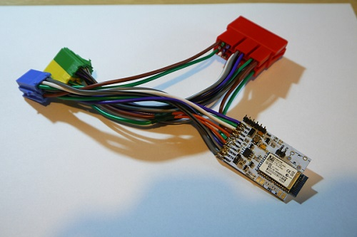

# MeganeBT
MeganeBT is a firmware for Bluetooth audio link for Renault UpdateList radio based on CD Changer emulation. AFFA display handling for song name presentation is also included.

### Description
MeganeBT is an CD Changer hardware emulator for Renault UpdateList Radio with Bluetooth audio link. As an audio link RN52 BT module is used. MeganeBT is controlled by STM32F042K6T6 uC. System emulates the operation of standard Renault CDC and plays audio using S/PDIF connection. User can control the playback using standard input on car radio and drive-wheel remote as the CDC commands are passed to BT module. Moreover RN52 offers  a BT profile with track information download. MeganeBT is designed to be connected to CAN bus between radio head unit and display. During BT playback MeganeBT controls the display and shows track’s title and artist.

### Important
Work still in progress, minor bugs may occur. More extensive testing is required.

### Connection diagram
TBD

### PCB Schematics
PCB schematics can be found in PCBSch folder of this repo. Schematics include additional elements, like standard audio analog output or mic input, that are not mandatory for normal operation or were not implemented.

### YouTube Video
To see MeganeBT in action click below

### Attributions
http://tlcdcemu.sourceforge.net/

http://megane.com.pl/topic/47797-wyswietlacz-radia-update-list-protokol/

### Photos

